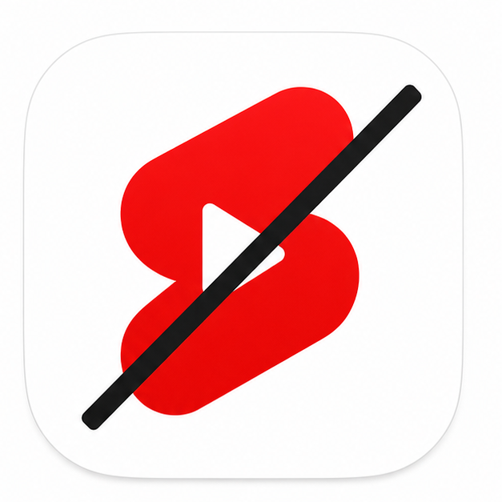

# CleanTube

<p align="center">
  
</p>

CleanTube is a Safari Web Extension for iOS that hides YouTube Shorts surfaces on `youtube.com`, `www.youtube.com`, and `m.youtube.com`.

It cannot affect the native YouTube iOS app. Apple only lets Safari extensions run inside Safari.

## Requirements

- macOS
- Xcode 26.4.1 or newer
- Homebrew
- Node.js
- XcodeGen

Install CLI dependencies:

```sh
brew install node xcodegen
```

Install project dependencies:

```sh
npm install
```

## Build For iPhone

Set Xcode as the active developer directory and accept the license:

```sh
sudo xcode-select --switch /Applications/Xcode.app/Contents/Developer
sudo xcodebuild -license accept
```

Generate the Xcode project:

```sh
npm run build:xcodeproj
```

Open the project in Xcode:

```sh
open src/CleanTube.xcodeproj
```

In Xcode:

1. Select the `CleanTube` project.
2. Set your Apple Development Team on both targets.
3. Build and run `CleanTube` on your iPhone.
4. On the iPhone, open Settings > General > VPN & Device Management > Trust Developer App
5. On the iPhone, open Settings > Safari > Extensions.
6. Enable CleanTube and allow access to YouTube.
